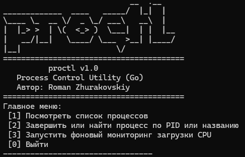
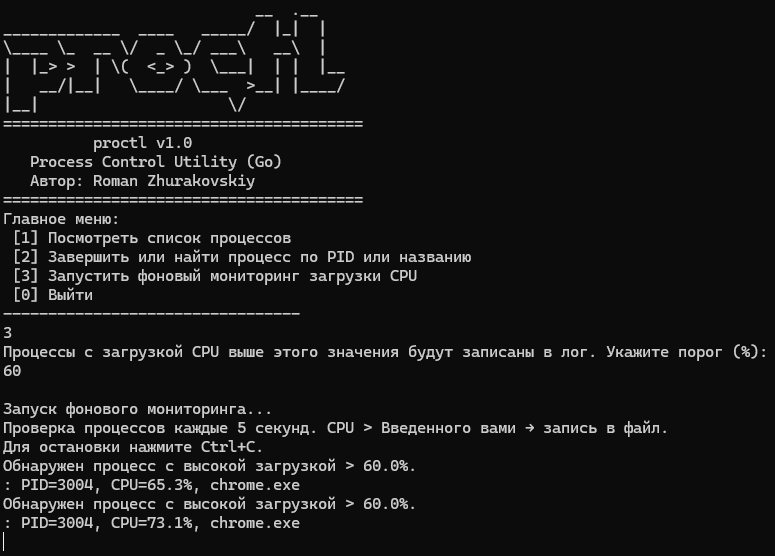
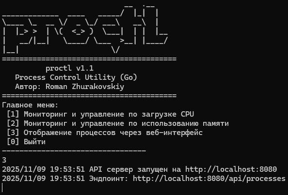
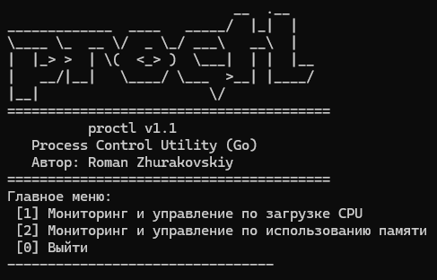

# proctl: CLI-утилита для мониторинга и управления системными процессами Linux, Windows

Утилита предоставляет интерактивное текстовое меню и поддерживает как разовый анализ, так и непрерывный мониторинг с записью событий в лог-файл.
Основные функции:
- Просмотр списка всех запущенных процессов с отображением PID и названия
- Завершение процессов по PID или по имени
- Поиск процессов по PID или названию
- Отображение неопределенных процессов. В будущих обновлениях, отображать опционально неопределенные процессы в отдельном слайсе

Фоновый режим мониторинга:
- Пользователь задаёт порог загрузки CPU (в процентах)
- Утилита автоматически проверяет процессы каждые 5 секунд
- Все процессы, превышающие заданный порог, записываются в файл .log

Будущие обновления в v1.1.0
 - Мониторинг и управление по использованию памяти
 - Правка бага с выходом из подменю раздела - Мониторинг и управление по загрузке CPU
 - Выход из режима поиска по PID или названию процесса по ctrl+c
 - Отображение неопределенных процессов в отдельном слайсе по запросу пользователя

Будущие обновления в v1.1.0 -> v1.1.0
 - Отображение процессов в web интерфейсе библиотеки React.js

Будущие обновления в v1.1.0 -> v1.2.0
 - Фоновый мониторинг CPU будет выполняться в отдельной горутине, не блокируя основное меню

Версии PATCH буду выпускаться вместе с MINOR версиями

## Скриншот старта утилиты

## Скриншот фонового сканирования

## Будущие обновления в v1.1

## Будущие обновления в v1.2

